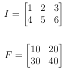
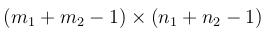
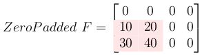
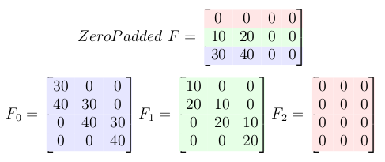
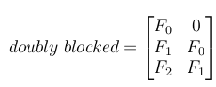
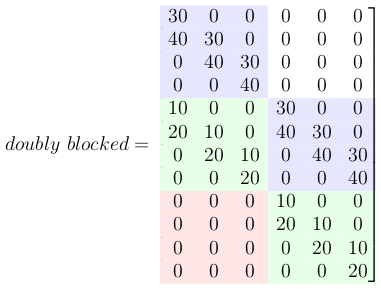
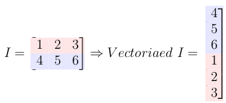
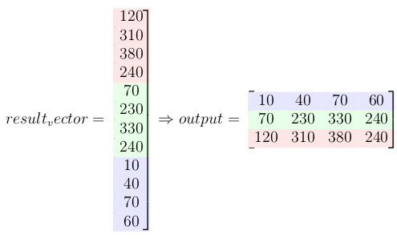

# Convolution as Matrix Multiplication
Step by step explanation of 2D convolution implemented as matrix multiplication using toeplitz matrices

## What is the purpose?

Instead of using `for-loops` to perform 2D convolution on images (or any other 2D matrices) we can convert the filter to a `Toeplitz matrix` and image to a vector and do the convolution just by one `matrix multiplication` (and of course some post-processing on the result of this multiplication to get the final result)

## Why do we do that?
There are many efficient matrix multiplication algorithms, so using them we can have an efficient implementation of convolution operation.

## What is in this document?
Mathematical and algorithmic explanation of this process. I will put a naive Python implementation of this algorithm to make it more clear. 

## Summary of the methods
### 1. Define Input and Filter

Let **I** be the input signal and **F** be the filter or kernel.

### 2. Calculate the final output size

If the I is **m1 x n1** and F is m2 x n2 the size of the output will be:

### 3. Zero-pad the filter matrix
Zero pad the filter to make it the same size as the output.

### 4. Create Toeplitz matrix for each row of the zero-padded filter

### 5. Create a doubly blocked Toeplitz matrix
Now all these small Toeplitz matrices should be arranged in a big doubly blocked Toeplitz matrix.

### 6. Convert the input matrix to a column vector

### 7. Multiply doubly blocked toeplitz matrix with vectorized input signal
This multiplication gives the convolution result.

### 8. Last step: reshape the result to a matrix form

  
See the implementation in python (jupyter notebook)  
[Look at the notebook](https://github.com/alisaaalehi/convolution_as_multiplication/blob/master/Convolution_as_multiplication.ipynb)
 or [Look at this pdf in this repo for more details](https://github.com/alisaaalehi/convolution_as_multiplication/blob/master/ConvAsMulExplained.pdf)
